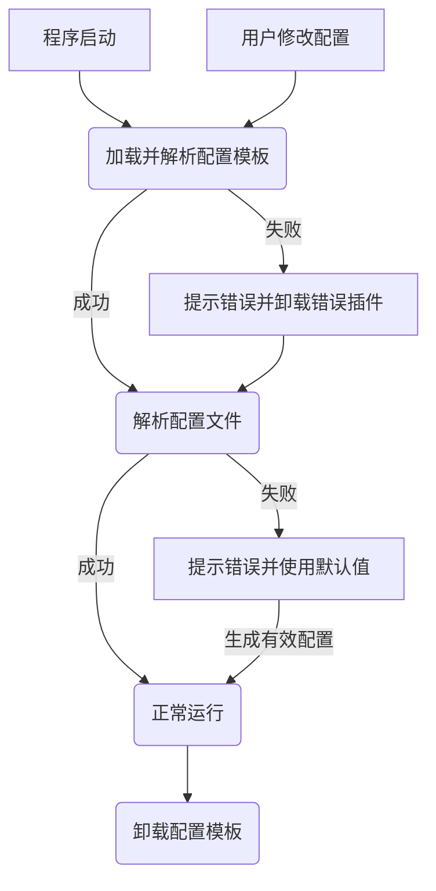

# 配置模板

TheCalculater使用配置模板来生成、管理与校验配置文件。

## 目录

- [格式](#格式)
- [配置项](#配置项)
    - [通用字段](#通用字段)
    - [`namespace`专用字段](#namespace专用字段)
    - [`integer`/`decimal`专用字段](#integer--decimal专用字段)
    - [`string`专用字段](#string专用字段)
    - [`list`专用字段](#list专用字段)
    - [`object`专用字段](#object专用字段)
    - [`enum`专用字段](#enum专用字段)
    - [`button`专用字段](#button专用字段)
- [表达式上下文](#表达式上下文)
    - [配置项信息](#配置项信息)
- [配置生命周期](#配置生命周期)
- [注意事项](#注意事项)
    - [配置名称限制](#配置名称限制)
    - [跨插件配置项引用](#跨插件配置项引用)
    - [配置项的命名空间](#配置项的命名空间)
    - [配置项不可见时的行为](#配置项不可见时的行为)
- [典型示例](#典型示例)
    - [程序外观配置模板](#程序外观配置模板)
- [最后](#最后)

## 格式

配置模板是一个JSON对象。一个示例的配置模板如下：
```json
{
    "foo": {
        "type": "namespace",
        "children": {
            "bar": {
                "type": "integer",
                "name": "my_plugin.foo.bar",
                "default": 0,
                "min": -100,
                "max": 100,
                "description": "my_plugin.foo.bar.description"
            },
            "baz": {
                "type": "boolean",
                "name": "my_plugin.foo.baz",
                "default": true,
                "warning": "my_plugin.foo.baz.warning" 
            },
            "qux": {
                "type": "list",
                "name": "my_plugin.foo.qux",
                "child_type": {
                    "type": "string"
                },
                "default": ["a", "b", "c"],
                "note": "my_plugin.foo.qux.note",
                "visible_if": "foo.baz.value"
            }
        }
    }
}
```
配置模板由一个个配置项组成，**每个配置项都是一个值类型为对象的键值对**。这些配置项可以是命名空间[^1]，可以是按钮，也可以是具体的配置项。

## 配置项

配置项通过不同的字段来定义其类型、默认值、校验规则等。不同类型的配置项支持的字段不同。

### 通用字段

#### `type`
此字段是**必需的**。它定义了配置项的类型，可以是以下值之一：
- `namespace`：表示这是一个命名空间，可以包含其他配置项。
- `integer`：表示这是一个整数类型的配置项。
- `decimal`：表示这是一个小数类型的配置项。
- `string`：表示这是一个字符串类型的配置项。
- `boolean`：表示这是一个布尔类型的配置项。
- `list`：表示这是一个列表类型的配置项。
- `object`：表示这是一个对象类型的配置项。
- `enum`：表示这是一个枚举类型的配置项。（关于与`string.enum`的区别，见[enum类型](#values)
- `button`：表示这是一个按钮类型的配置项。

#### `name`
此字段是**可选的**。它定义了配置项显示的名字，其值是一个[翻译键](./translations.md#翻译键)。建议总是定义`name`以便于用户理解配置项的用途。

#### `default`
此字段是**必需的**。它定义了配置项的默认值，其格式与在配置文件中的值格式相同。

#### `description` / `note` / `warning`
此字段是**可选的**。它定义了配置项的描述/提示/警告，其值是一个[翻译键](./translations.md#翻译键)。建议总是定义`description`以便于用户理解配置项的用途。

#### `visible_if`
此字段是**可选的**。它定义了配置项的可视性条件，其值是一个[JMESPATH表达式](https://jmespath.org/)[^2]，此表达式的结果*必须为布尔值*。只有当此表达式的结果为`true`时，配置项才会在界面上显示。关于表达式中可用的上下文，见[表达式上下文](#表达式上下文)。不能与`visible_unless`同时使用。

#### `visible_unless`
此字段是**可选的**。同`visible_if`，但其逻辑相反。只有当此表达式的结果为`false`时，配置项才会在界面上显示。不能与`visible_if`同时使用。

#### `deprecated`
此字段是**可选的**。其值是一个[翻译键](./translations.md#翻译键)，定义了配置项的弃用提示。若此字段被设置，则配置项会被标记为已弃用，并在界面上显示该提示。

### `namespace`专用字段

#### `children`
此字段是**必需的**。其值是一个对象，它的键值对即为命名空间内的配置项。

> ⚠️ 注意：`namespace`类型的配置项只能含有`children`、`type`和`name`字段。

### `integer` / `decimal`专用字段

#### `min` / `max`
此字段是**可选的**。它们定义了整数的最小值和最大值，若未定义则视为无限制。

### `string`专用字段

#### `enum`
此字段是**可选的**。其值是一个字符串数组，定义了字符串修改框旁下拉栏的填充选项。

#### `regex`
此字段是**可选的**。其值是一个正则表达式，定义了字符串输入框旁的正则校验。如正则校验不通过，则会显示错误提示。

### `list`专用字段

#### `child_type`
此字段是**必需的**。其值是一个对象，定义了列表中元素的类型。此对象的格式与*配置项的值*的格式相同，但类型不能为`namespace`或`button`，且只能含有`type`、`min`、`max`、`regex`、`child_type`、`properties`、`values`字段。（此规则只适用于此对象本身）(*此对象不能含有`default`字段*)

### `object`专用字段

#### `properties`
此字段是**必需的**。其值是一个对象。它的键值对与*配置项*的格式相同，但每一个键值对的值类型不能为`namespace`或`button`，且只能含有`type`、`default`、`min`、`max`、`regex`、`child_type`、`properties`字段。（此规则只适用于每一个键值对的值本身）

### `enum`专用字段

#### `values`
此字段是**必需的**。其值是一个字符串数组，定义了枚举类型的所有可能取值。

**关于`enum`类型与`string.enum`的区别**：简单来说，`enum`类型的取值只能为`values`数组中的值，而`string.enum`类型的取值可以为任意字符串。`string.enum`字段只起到提示作用，并不会限制取值范围。

### `button`专用字段

#### `action`
此字段是**必需的**。其值是一个字符串，定义了按钮点击的动作id。此id必须是唯一的。使用此字段时，你还需要在你的插件的初始化函数中加入动作处理器。使用`TheCalculater::settings::register_action()`函数注册动作处理器。下面是一个例子：
```cpp
void MyPlugin::init()
{
    TheCalculater::settings::register_action("my_plugin.foo.bar", []() {
        QMessageBox::information(nullptr, "My Plugin", "Hello, World!");
    });
}
```
上面这个例子中，我们假设你定义了一个按钮`my_plugin.foo.bar`，且定义了字段`action`为`my_plugin.foo.bar`。当用户点击这个按钮时，会弹出一个消息框显示"Hello, World!"。

对于`action`字段，我们建议使用配置项的路径作为动作id，这样可以避免命名冲突。

> ⚠️ 注意：`button`类型的配置项不能含有`default`字段。

> ⚠️ 注意：**如果不注册动作处理器，则点击按钮不会有任何效果！**

## 表达式上下文

以下列出了在[JMESPATH表达式](https://jmespath.org/)中可用的上下文与例子。为了演示，我们假设你的插件名为`my_plugin`。

### 配置项信息

> 注：要获取你的插件中的配置项的值，请在配置项路径前加上`<你的插件名>.`。

#### 获取配置项的值
可以使用`<配置项路径>.value`获取配置项的值。此值与在配置文件中的值格式相同。以下是一个例子：
```json
{
    "foo": {
        "type": "boolean",
        "default": true
    },
    "bar": {
        "type": "integer",
        "default": 0,
        "visible_if": "my_plugin.foo.value"
    }
}
```
这个例子中，`bar`配置项只有在`foo`为真时才可见。

#### 判断配置项是否可见
可以使用`<配置项路径>.visible`判断配置项是否可见（类型为布尔值）。以下是一个例子：
```json
{
    "foo": {
        "type": "integer",
        "default": 0,
    },
    "bar": {
        "type": "decimal",
        "default": 0.0,
        "visible_if": "my_plugin.foo.value > 100"
    },
    "baz": {
        "type": "boolean",
        "default": true,
        "visible_if": "my_plugin.bar.visible && my_plugin.bar.value < 0"
    }
}
```
这个例子中，`bar`配置项只有在`foo > 100`时才可见。而`baz`配置项只有在`bar`可见且其值小于0时才可见。

#### 获取配置项属性
要获取配置项的属性（如类型、默认值等在配置模板中定义的字段），可以使用`<配置项路径>.<属性名>`。以下是一个例子：
```json
{
    "foo": {
        "type": "integer",
        "default": 0
    },
    "bar": {
        "type": "boolean",
        "default": true,
        "visible_if": "my_plugin.foo.default != my_plugin.foo.value"
    }
}
```
这个例子中，`bar`配置项只有在`foo`被修改过时（即`foo`的默认值不等于当前值时）才可见。

## 配置生命周期
下面是配置模板的生命周期图：


## 注意事项

### 配置名称限制
配置项的名称必须符合以下规则：
- 只能包含字母、数字和下划线。
- 不能以数字开头。
- 不能为空字符串。

### 跨插件配置项引用
请在你的插件的`plugin.json`的`depends`字段中声明你依赖的插件，然后在配置模板中使用该插件的名称作为前缀来引用其配置项。否则，如果用户未安装你依赖的插件，则可能会导致你的插件出现没有预期的行为。

### 配置项的命名空间
所有在你插件中定义的配置项都会位于你的插件的命名空间下。这是为了避免不同插件之间的配置项冲突。例如，即使你在你的插件的配置模板的最顶层定义了一个名为`foo`的配置项，你也仍然需要使用`my_plugin.foo`来引用它。

### 配置项不可见时的行为
如果一个配置项由于`visible_if`或`visible_unless`字段的原因而不可见，则如果在`settings.json`中存在该配置项的值，此值也会被忽略。

## 典型示例

### 程序外观配置模板
这个示例的插件名字为`appearance`，它允许用户自定义程序的主题颜色。
```json
{
    "theme": {
        "type": "namespace",
        "name": "appearance.theme",
        "children": {
            "theme": {
                "type": "enum",
                "default": "light",
                "values": ["light", "dark", "custom"],
                "name": "appearance.theme.theme",
                "description": "appearance.theme.theme.desc"
            },
            "custom_theme_file": {
                "type": "string",
                "default": "",
                "name": "appearance.theme.custom_theme_file",
                "description": "appearance.theme.custom_theme_file.desc",
                "visible_if": "my_plugin.theme.value == 'custom'",
                "regex": "^.+\\.(css|scss)$",
                "note": "appearance.theme.custom_theme_file.note"
            }
        }
    },
    "font": {
        "type": "namespace",
        "name": "appearance.font",
        "children": {
            "font_size": {
                "type": "integer",
                "default": 16,
                "min": 8,
                "max": 32,
                "name": "appearance.font.font_size",
                "description": "appearance.font.font_size.desc"
            },
            "font_family": {
                "type": "list",
                "default": ["Arial", "Helvetica"],
                "child_type": {
                    "type": "string"
                },
                "name": "appearance.font.font_family",
                "description": "appearance.font.font_family.desc"
            }
        }
    },
    "performance": {
        "type": "namespace",
        "name": "appearance.performance",
        "children": {
            "animations": {
                "type": "boolean",
                "default": true,
                "name": "appearance.performance.animations",
                "description": "appearance.performance.animations.desc"
            },
            "transparent_and_blur": {
                "type": "namespace",
                "children": {
                    "enabled_elements": {
                        "type": "object",
                        "name": "appearance.performance.transparent_and_blur.enabled_elements",
                        "description": "appearance.performance.transparent_and_blur.enabled_elements.desc",
                        "properties": {
                            "all": {
                                "type": "boolean",
                                "default": true
                            },
                            "sidebar": {
                                "type": "boolean",
                                "default": false
                            },
                            "headerbar": {
                                "type": "boolean",
                                "default": false
                            },
                            "main": {
                                "type": "boolean",
                                "default": false
                            } 
                        },
                        "default": {
                            "all": true
                        }
                    },
                    "opacity": {
                        "type": "decimal",
                        "default": 0.8,
                        "min": 0,
                        "max": 1,
                        "name": "appearance.performance.transparent_and_blur.opacity",
                        "description": "appearance.performance.transparent_and_blur.opacity.desc"
                    },
                    "blur": {
                        "type": "integer",
                        "default": 10,
                        "min": 0,
                        "max": 20,
                        "name": "appearance.performance.transparent_and_blur.blur",
                        "description": "appearance.performance.transparent_and_blur.blur.desc"
                    }
                },
                "name": "appearance.performance.transparent_and_blur"
            }
        }
    }
}
```

## 最后
完成配置模板的编写后，把它放在你的插件的`plugin.json`的`config_template`字段中！像这样：
```json5
{
    "name": "my_plugin.name",
    "description": "my_plugin.description",
    "version": "1.0.0",
    "config_template": {
        "foo": {
            "type": "string",
            "default": "bar",
            "name": "my_plugin.foo",
            "description": "my_plugin.foo.desc"
        },
        // 更多配置项...
    },
    "depends": ["another_plugin"],
    "translations": {
        // 翻译内容...
    }
}
```

[^1]: **命名空间**： 命名空间是一种特殊的配置项，它本身不包含任何值，而是用来组织其他配置项的。例如，你可以创建一个名为`foo`的命名空间，然后在其中创建多个子配置项，如`bar`、`baz`等。这样做的目的是为了更好地组织你的配置项，使其更加清晰、易于管理。
[^2]: **JMESPATH表达式**： JMESPath是一种查询语言，用于从JSON文档中提取数据。它类似于XPath或XQuery，但专为处理JSON设计。在配置模板中，你可以使用JMESPath表达式来定义配置项的可见性条件。