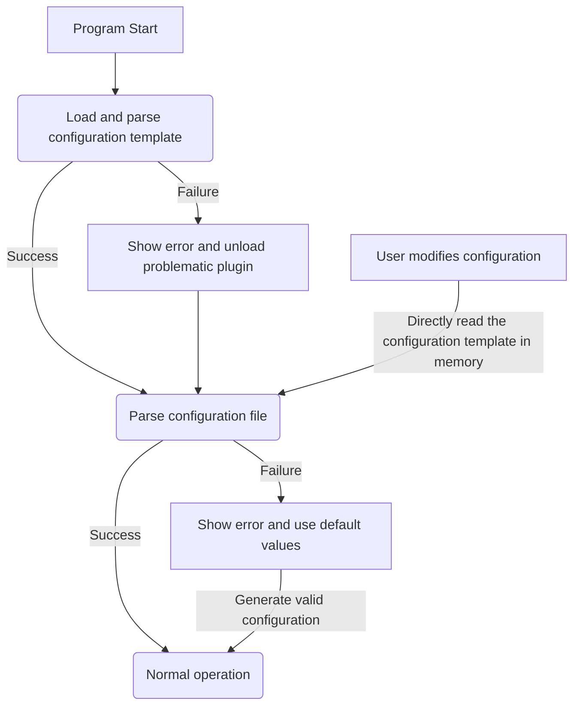

# Configuration Template

TheCalculater uses configuration templates to generate, manage, and validate configuration files.

## Table of Contents

- [Format](#format)
- [Configuration Items](#configuration-items)
    - [Common Fields](#common-fields)
    - [Namespace-Specific Fields](#namespace-specific-fields)
    - [`integer`/`decimal`-Specific Fields](#integer--decimal-specific-fields)
    - [`string`-Specific Fields](#string-specific-fields)
    - [`list`-Specific Fields](#list-specific-fields)
    - [`object`-Specific Fields](#object-specific-fields)
    - [`enum`-Specific Fields](#enum-specific-fields)
    - [`button`-Specific Fields](#button-specific-fields)
- [Configuration Lifecycle](#configuration-lifecycle)
- [Notes](#notes)
    - [Configuration Name Restrictions](#configuration-name-restrictions)
    - [Cross-Plugin Configuration Item References](#cross-plugin-configuration-item-references)
    - [Namespace of Configuration Items](#namespace-of-configuration-items)
    - [Behavior of Invisible Configuration Items](#behavior-of-invisible-configuration-items)
- [Typical Examples](#typical-examples)
    - [Application Appearance Configuration Template](#application-appearance-configuration-template)
- [Final Steps](#final-steps)

## Format

A configuration template is a JSON object. An example configuration template is as follows:
```json
{
    "foo": {
        "type": "namespace",
        "children": {
            "bar": {
                "type": "integer",
                "name": "my_plugin.foo.bar",
                "default": 0,
                "min": -100,
                "max": 100,
                "description": "my_plugin.foo.bar.description"
            },
            "baz": {
                "type": "boolean",
                "name": "my_plugin.foo.baz",
                "default": true,
                "warning": "my_plugin.foo.baz.warning" 
            },
            "qux": {
                "type": "list",
                "name": "my_plugin.foo.qux",
                "child_type": {
                    "type": "string"
                },
                "default": ["a", "b", "c"],
                "note": "my_plugin.foo.qux.note"
            }
        }
    }
}
```
The configuration template consists of configuration items, **where each item is a key-value pair with an object as its value**. These items can be namespaces[^1], buttons, or specific configuration items.

## Configuration Items

Configuration items are defined using different fields to specify their type, default value, validation rules, etc. Different types of configuration items support different fields.

### Common Fields

#### `type`
This field is **required**. It defines the type of the configuration item, which can be one of the following values:
- `namespace`: Indicates a namespace that can contain other configuration items.
- `integer`: Indicates an integer-type configuration item.
- `decimal`: Indicates a decimal-type configuration item.
- `string`: Indicates a string-type configuration item.
- `boolean`: Indicates a boolean-type configuration item.
- `list`: Indicates a list-type configuration item.
- `object`: Indicates an object-type configuration item.
- `enum`: Indicates an enum-type configuration item. (For differences from `string.enum`, see [enum type](#values))
- `button`: Indicates a button-type configuration item.

#### `name`
This field is **optional**. It defines the display name of the configuration item, and its value is a [translation key](./translations_en.md#translation-keys). It is recommended to always define `name` to help users understand the purpose of the configuration item.

#### `default`
This field is **required**. It defines the default value of the configuration item, with the same format as in the configuration file.

#### `description` / `note` / `warning`
This field is **optional**. It defines the description/note/warning of the configuration item, and its value is a [translation key](./translations_en.md#translation-keys). It is recommended to always define `description` to help users understand the purpose of the configuration item.

#### `deprecated`
This field is **optional**. Its value is a [translation key](./translations_en.md#translation-keys) that defines the deprecation notice for the configuration item. If this field is set, the configuration item will be marked as deprecated and display this notice in the interface.

### `namespace`-Specific Fields

#### `children`
This field is **required**. Its value is an object where the key-value pairs represent the configuration items within the namespace.

> ⚠️ Note: `namespace`-type configuration items can only contain `children`, `type`, and `name` fields.

### `integer` / `decimal`-Specific Fields

#### `min` / `max`
This field is **optional**. They define the minimum and maximum values for integers/decimals. If undefined, there are no limits.

### `string`-Specific Fields

#### `enum`
This field is **optional**. Its value is a string array that defines the options for the dropdown next to the string input field.

#### `regex`
This field is **optional**. Its value is a regular expression that defines validation for the string input field. If the regex validation fails, an error message will be displayed.

### `list`-Specific Fields

#### `child_type`
This field is **required**. Its value is an object that defines the type of elements in the list. The format of this object is the same as the *value of a configuration item*, but its type cannot be `namespace` or `button`, and it can only contain `type`, `min`, `max`, `regex`, `child_type`, `properties`, `values` fields. (This rule applies only to this object itself) (*This object cannot contain a `default` field*)

### `object`-Specific Fields

#### `properties`
This field is **required**. Its value is an object. Its key-value pairs follow the same format as *configuration items*, but each value cannot be of type `namespace` or `button`, and can only contain `type`, `default`, `min`, `max`, `regex`, `child_type`, `properties` fields. (This rule applies only to each key-value pair's value itself)

### `enum`-Specific Fields

#### `values`
This field is **required**. Its value is a string array that defines all possible values for the enum type.

**Difference between `enum` type and `string.enum`**: Simply put, the value of an `enum` type can only be one of the values in the `values` array, while a `string.enum` type can have any string value. The `string.enum` field only serves as a hint and does not restrict the value range.

### `button`-Specific Fields

#### `text`
This field is **required**. Its value is a [translation key](./translations_en.md#translation-keys) that defines the text displayed on the button.

**Register Button Click Event Listener**: You need to call `registerButtonClickedEventListener()` in your code to register a button click event listener and handle your logic within it. For example:
```cpp
MyPlugin::init()
{
    TheCalculater::settings::registerButtonClickedEventListener([](std::string_view button) {
        if (button == "my_plugin.foo.bar") {
            QMessageBox::information(nullptr, "My Plugin", "Hello, world!");
        }
    });
}
```
In this way, when the user clicks on your button (path `my_plugin.foo.bar`), a message box will pop up.

> ⚠️ Note: `button`-type configuration items cannot contain a `default` field.

## Configuration Lifecycle
Below is the lifecycle diagram of the configuration template:


## Notes

### Configuration Name Restrictions
Configuration item names must comply with the following rules:
- Can only contain letters, numbers, and underscores.
- Cannot be an empty string.

### Cross-Plugin Configuration Item References
Declare the plugins you depend on in the `depends` field of your plugin's `plugin.json`. Then reference their configuration items using the plugin name as a prefix in your configuration template. Otherwise, if the user hasn't installed a plugin you depend on, your plugin may exhibit unexpected behavior.

### Namespace of Configuration Items
All configuration items defined in your plugin will be under your plugin's namespace. This prevents conflicts between configuration items of different plugins. For example, even if you define a top-level configuration item named `foo` in your plugin's configuration template, you still need to reference it as `my_plugin.foo`.

### String Representation of `integer` and `decimal` Types
Sometimes, to represent values more accurately, `integer` and `decimal` items can use strings in configuration files. Example:
```json5
{
    // This is valid
    "my_plugin.foo": "1919810.114514"
}
```
> Note: This is due to implementation constraints. Definitely not because I don't want to change the JSONCpp logic for parsing numbers.

## Typical Examples

### Application Appearance Configuration Template
This example plugin is named `appearance`, allowing users to customize the theme color of the application.
```json
{
    "theme": {
        "type": "namespace",
        "name": "appearance.theme",
        "children": {
            "theme": {
                "type": "enum",
                "default": "light",
                "values": ["light", "dark", "custom"],
                "name": "appearance.theme.theme",
                "description": "appearance.theme.theme.desc"
            },
            "custom_theme_file": {
                "type": "string",
                "default": "",
                "name": "appearance.theme.custom_theme_file",
                "description": "appearance.theme.custom_theme_file.desc",
                "regex": "^.+\\.(css|scss)$",
                "note": "appearance.theme.custom_theme_file.note"
            }
        }
    },
    "font": {
        "type": "namespace",
        "name": "appearance.font",
        "children": {
            "font_size": {
                "type": "integer",
                "default": 16,
                "min": 8,
                "max": 32,
                "name": "appearance.font.font_size",
                "description": "appearance.font.font_size.desc"
            },
            "font_family": {
                "type": "list",
                "default": ["Arial", "Helvetica"],
                "child_type": {
                    "type": "string"
                },
                "name": "appearance.font.font_family",
                "description": "appearance.font.font_family.desc"
            }
        }
    },
    "performance": {
        "type": "namespace",
        "name": "appearance.performance",
        "children": {
            "animations": {
                "type": "boolean",
                "default": true,
                "name": "appearance.performance.animations",
                "description": "appearance.performance.animations.desc"
            },
            "transparent_and_blur": {
                "type": "namespace",
                "children": {
                    "enabled_elements": {
                        "type": "object",
                        "name": "appearance.performance.transparent_and_blur.enabled_elements",
                        "description": "appearance.performance.transparent_and_blur.enabled_elements.desc",
                        "properties": {
                            "all": {
                                "type": "boolean",
                                "default": true
                            },
                            "sidebar": {
                                "type": "boolean",
                                "default": false
                            },
                            "headerbar": {
                                "type": "boolean",
                                "default": false
                            },
                            "main": {
                                "type": "boolean",
                                "default": false
                            } 
                        },
                        "default": {
                            "all": true
                        }
                    },
                    "opacity": {
                        "type": "decimal",
                        "default": 0.8,
                        "min": 0,
                        "max": 1,
                        "name": "appearance.performance.transparent_and_blur.opacity",
                        "description": "appearance.performance.transparent_and_blur.opacity.desc"
                    },
                    "blur": {
                        "type": "integer",
                        "default": 10,
                        "min": 0,
                        "max": 20,
                        "name": "appearance.performance.transparent_and_blur.blur",
                        "description": "appearance.performance.transparent_and_blur.blur.desc"
                    }
                },
                "name": "appearance.performance.transparent_and_blur"
            }
        }
    }
}
```
The corresponding example profile is shown below:
```json
{
    "appearance.theme.theme": "custom",
    "appearance.theme.custom_theme_file": "/usr/share/themes/my_theme.css",
    "appearance.font.font_size": 18,
    "appearance.font.font_family": ["Arial", "Helvetica", "Times New Roman"],
    // We don't need to write this line because it is the default value.
    // "appearance.performance.animations": true,
    "appearance.performance.transparent_and_blur.enabled_elements": {
        "all": false,
        "sidebar": true
    },
    "appearance.performance.transparent_and_blur.opacity": 0.9,
    "appearance.performance.transparent_and_blur.blur": 15
}
```

## Final Steps
After completing your configuration template, place it in the `config_template` field of your plugin's `plugin.json`! Like this:
```json5
{
    "name": "my_plugin.name",
    "description": "my_plugin.description",
    "version": "1.0.0",
    "config_template": {
        "foo": {
            "type": "string",
            "default": "bar",
            "name": "my_plugin.foo",
            "description": "my_plugin.foo.desc"
        },
        // More configuration items...
    },
    "depends": ["another_plugin"],
    "translations": {
        // Translation content...
    }
}
```

[^1]: **Namespace**: A namespace is a special type of configuration item that does not contain any value itself but is used to organize other configuration items. For example, you can create a namespace named `foo` and then create multiple sub-items within it, such as `bar`, `baz`, etc. The purpose is to better organize your configuration items, making them clearer and easier to manage.

> Note: This document is translated from Chinese to English by AI. There may be inaccuracies.